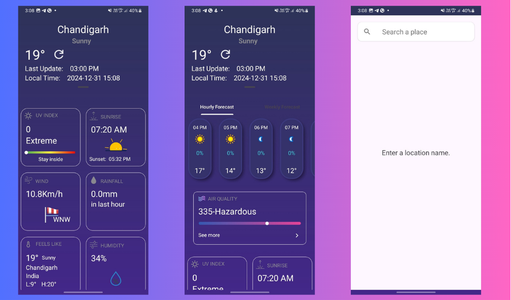
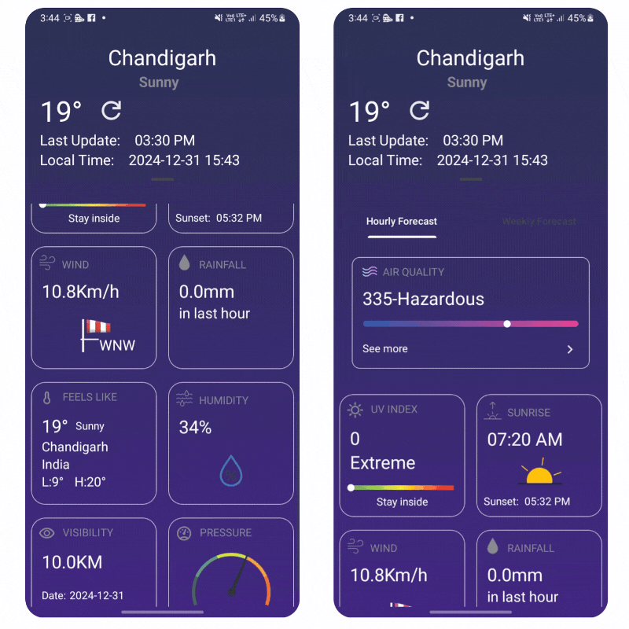

# Weather App - Android (Java)

## App Introduction

Welcome to the **Weather App**! 🌍🌦️

This Android app allows users to get the current weather of a location by either:
- **Searching for a location by name** using **Google Location Search** (Autocomplete).
- **Allowing location permissions** to fetch the weather based on the user's current **latitude** and **longitude** using **FusedLocationProviderClient**.

### Features:
- **Search by Place Name**: Use Google Places Autocomplete to search for any location by name. Once a location is selected, the app fetches weather data for that location.
- **Real-Time Weather Data**: Displays the current temperature, humidity, wind speed, and weather conditions.
- **Current Location Weather**: Fetch the user's current location (latitude and longitude) using FusedLocationProviderClient and show the weather for that location.
- **User-Friendly Interface**: Easy-to-use interface with location search and weather details.

## Screenshots




## Technologies Used

The app is built using the following technologies:

- **Frontend**: 
  - Java (Android)
  - XML (for layout)
- **API**:
  - **OpenWeatherMap API** (for weather data)
  - **Google Places API** (for location search)
- **Libraries**:
  - Volley (for network requests)
  - Google Play Services (for FusedLocationProviderClient)
- **Others**:
  - Android SDK
  - Gradle (build automation)

## Prerequisites

Before running the app, make sure you have the following installed:

1. **Android Studio**: Download from [here](https://developer.android.com/studio).
2. **Google Maps API Key**: You need an API key to use Google Places Autocomplete and FusedLocationProviderClient. Follow these steps:
   - Go to the [Google Cloud Console](https://console.cloud.google.com/).
   - Enable **Google Places API** and **Google Maps SDK for Android**.
   - Create a new project and obtain an API Key.
   - Add your API key to the `google_maps_api.xml` file.
3. **OpenWeatherMap API Key**: Sign up at [OpenWeatherMap](https://openweathermap.org/) to get your API key for fetching weather data.

## Usage Instructions

To get started with the Weather App:

1. **Clone the repository**:
   ```bash
   git clone https://github.com/Sj9756/Weather-Wise

## License

Apache License
Version 2.0, January 2004
http://www.apache.org/licenses/

Copyright 2024 santosh joshi

Licensed under the Apache License, Version 2.0 (the "License");
you may not use this file except in compliance with the License.
You may obtain a copy of the License at

    http://www.apache.org/licenses/LICENSE-2.0

Unless required by applicable law or agreed to in writing, software
distributed under the License is distributed on an "AS IS" BASIS,
WITHOUT WARRANTIES OR CONDITIONS OF ANY KIND, either express or implied.
See the License for the specific language governing permissions and
limitations under the License.
